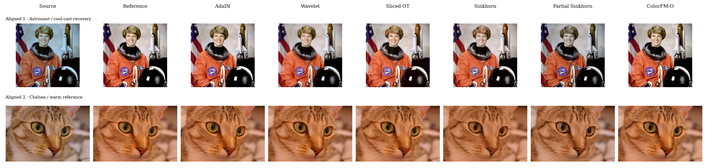
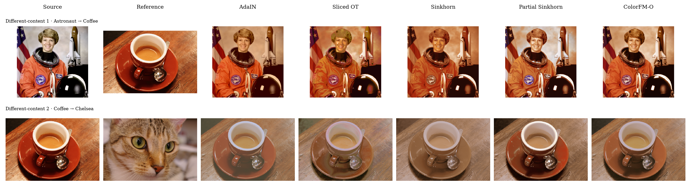

# colortransfer-triton

[简体中文](README.zh-CN.md) · [Installation](#get-started) · [API](#python) · [Methods](#methods) · [Benchmark](#benchmark)

ColorTransfer Triton implements AdaIN, Wavelet, Sliced OT, Sinkhorn and ColorFM-O
color transfer with Triton GPU kernels and a PyTorch tensor API. No pretrained weights.

## Qualitative examples



**Figure 1.** Aligned pairs: Astronaut cool-cast recovery and Chelsea warm grading. [PDF](assets/aligned.pdf)



**Figure 2.** Different-content pairs: Astronaut → Coffee and Coffee → Chelsea. [PDF](assets/unaligned.pdf)

## Get started

Linux, Python 3.10+, NVIDIA GPU, CUDA PyTorch 2.6+ and compatible Triton 3.2+.

```bash
python -m pip install -e .
```

### Python

```python
import torch
import colortransfer_triton as ct

source = torch.rand(1, 3, 512, 512, device="cuda")  # replace with RGB images
reference = torch.rand_like(source)
result = ct.adain(source, reference)
result = ct.transfer(source, reference, method="sliced_ot")

lut = ct.fit_colorfm(source, reference, steps=700)
result = lut(source, strength=0.8)  # reuse without fitting again
```

| Tensor | Contract |
|---|---|
| `source` | NCHW RGB, finite values in `[0,1]`, CUDA float16/bfloat16/float32 |
| `reference` | Same device; batch size 1 or matching the source; spatial size may differ except for Wavelet |
| Output | Same shape and device as the source, contiguous float32 |

The image API is inference-only; detach inputs that require gradients.

## Methods

| Method | Mechanism | When to use |
|---|---|---|
| `ct.adain` | Match RGB channel means and variances independently | Global color-cast and contrast adjustment |
| `ct.wavelet` | Retain source high frequencies and replace low frequencies | Restore color from a spatially aligned reference |
| `ct.sliced_ot` | Repeatedly project colors onto random directions and match sorted values | Match color distributions beyond channel statistics |
| `ct.sinkhorn` | Entropy-regularized transport with a barycentric color map | Joint RGB distribution matching with adjustable smoothing |
| `ct.partial_sinkhorn` | Transport only part of the distribution mass | References with colors that should not all be matched |
| `ct.colorfm` | Fit a color velocity field and integrate its flow | Nonlinear color mapping through per-pair optimization |

Wavelet uses an undecimated, dilated binomial pyramid, not a Haar/DWT transform.
Its reference must have the same dimensions and spatial alignment. The other methods
match color distributions without spatial correspondence or semantic object matching.

ColorFM implements the nonsemantic [ColorFM-O](https://github.com/cszn/ColorFM) variant.
It trains a small MLP from scratch for each pair using sampled RGB colors: no pretrained
weights or segmentation model, but an optimization stage is required. AdaIN, Wavelet
and the OT methods do not train a neural network.

OT/ColorFM use sampled fitting and a 3D LUT approximation. Reuse maps with
`ct.fit_lut` or `ct.fit_colorfm`. `strength` controls blending; `clamp=True` clips to `[0,1]`.

### Reuse a color map

```python
lut = ct.fit_lut(
    source, reference,
    method="sinkhorn", samples=1024, lut_size=33,
    epsilon=0.03, iterations=100, seed=0,
)
result = lut(source, strength=0.8)
```

Fitting runs on sampled colors; the full image uses Triton trilinear LUT lookup with
fused blending and clipping. This avoids a full-resolution pixel-to-pixel transport
matrix on large images. A fitted map can be applied at other resolutions, but remains
specific to the fitted color distributions; refit when the scene or reference changes.

### Key parameters

| Parameter | Default | Effect |
|---|---|---|
| `strength` | `1.0` | Output blend in `[0,1]`; `0` retains the source, `1` applies the full transfer |
| Wavelet `levels` | `5` | More levels restrict replacement to coarser color variations |
| OT `samples` | `1024` | More samples improve distribution coverage; Sinkhorn matrix storage grows quadratically |
| `lut_size` | `33` | RGB grid edge length; table size grows cubically |
| OT `iterations` | `32` / `100` | Sliced OT projections / Sinkhorn updates |
| Sinkhorn `epsilon` | `0.03` | Larger values smooth transport; smaller values may require more iterations |
| Partial Sinkhorn `mass` | `0.8` | Fraction of distribution mass transported, not an output blend |
| ColorFM `steps` / `samples` | `700` / `16384` | Optimization steps and sampled colors |
| ColorFM `ode_steps` | `5` | Midpoint integration steps used to build the LUT |

Sinkhorn convergence is available in `lut.diagnostics` as `marginal_error`;
a fixed iteration count does not guarantee convergence.

## Reproduce figures

```bash
python -m pip install -e ".[figures]"
python examples/color_transfer.py --suite --output assets --save-images
python examples/color_transfer.py --source source.png --reference reference.png --save-images
```

## Benchmark

```bash
python benchmarks/benchmark.py --height 2160 --width 3840 --repeats 30
python benchmarks/benchmark.py --colorfm --repeats 5
```

## Tests

```bash
python -m pip install -e ".[test,figures]"
python -m pytest -q
```

## License

[MIT](LICENSE). Example photographs from scikit-image: Astronaut (NASA, public domain), Chelsea (Stefan van der Walt, CC0), Coffee (Rachel Michetti, CC0).
